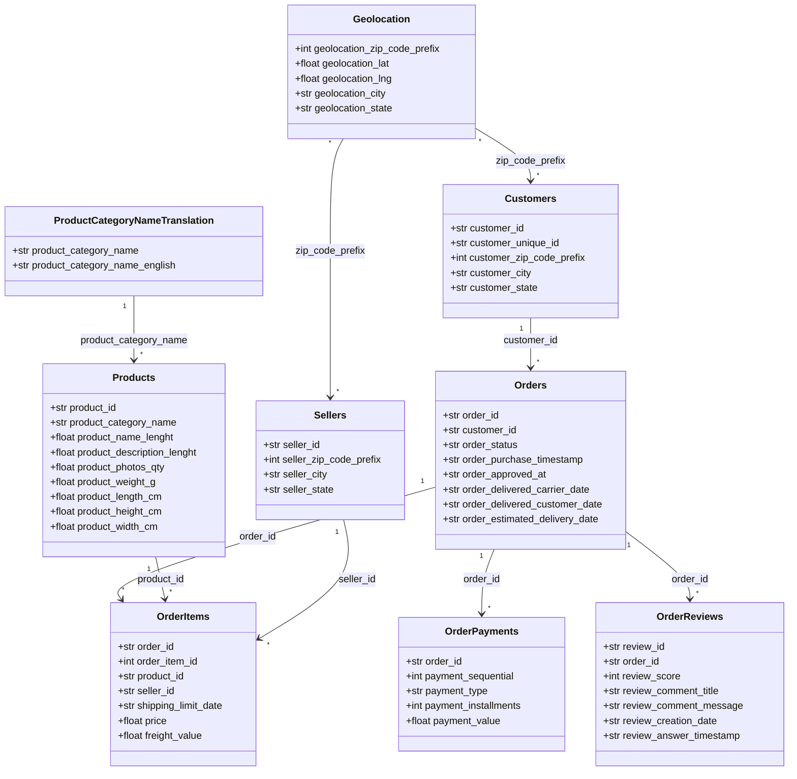
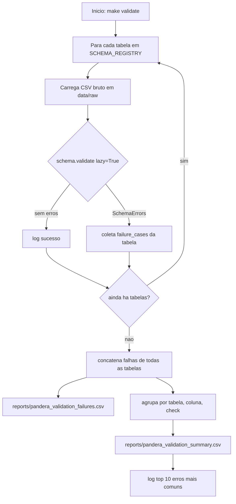

# Data Pipeline: Relacionamento e Validação (pandera)

Documentação do trabalho feito sobre os dados brutos da Olist: mapeamento do
modelo relacional entre as 9 tabelas e um pipeline de validação de qualidade
de dados com [pandera](https://pandera.readthedocs.io/).

## 1. Modelo de dados (UML)

Diagrama de classes UML das 9 tabelas brutas, com seus atributos e as
associações (chaves estrangeiras) entre elas.



> `customer_id` identifica um **pedido** do cliente, não a pessoa —
> `customer_unique_id` é quem identifica a pessoa (um cliente pode ter vários
> `customer_id`, um por pedido). 2.997 clientes têm mais de um `customer_id`.

Integridade referencial verificada (chaves do lado "filho" ausentes no lado
"pai"): **zero órfãos** em `orders→customers`, `items→orders`,
`items→products`, `items→sellers`, `payments→orders` e `reviews→orders`.
Existem órfãos apenas nas relações via zip code (`customers`/`sellers` →
`geolocation`) e em 13 categorias de produto sem tradução — ver notebook
`notebooks/olist_data_relationships.ipynb`.

## 2. Schemas de validação (pandera)

Cada tabela tem um `pandera.DataFrameModel` correspondente em
`module_olist/schemas.py`, com `strict=True`
(nenhuma coluna extra/faltando é aceita) e `coerce=True`. As regras
codificam o conhecimento de domínio levantado na exploração:

| Schema | Regras principais |
|---|---|
| `OrdersSchema` | `order_id` único; `order_status` restrito a 8 valores válidos |
| `CustomersSchema` | `customer_id` único; UF com 2 letras |
| `OrderItemsSchema` | `price > 0`; `freight_value >= 0` |
| `OrderPaymentsSchema` | `payment_type` restrito a 5 valores; `0 <= payment_installments <= 24` |
| `OrderReviewsSchema` | `1 <= review_score <= 5` |
| `ProductsSchema` | dimensões/peso `> 0` quando presentes (nulos permitidos) |
| `SellersSchema` | UF com 2 letras |
| `GeolocationSchema` | lat/lng dentro do bounding box aproximado do Brasil |
| `ProductCategoryNameTranslationSchema` | `product_category_name` único |

`SCHEMA_REGISTRY` mapeia `nome_do_csv → schema`, usado tanto pelo pipeline
quanto por notebooks/testes que queiram validar uma tabela isolada.

## 3. Pipeline de validação (fluxo)

`module_olist/validation.py` roda como
CLI (`typer`), no mesmo padrão dos demais módulos (`dataset.py`,
`features.py`).



Executar:

```bash
make validate
# ou
python module_olist/validation.py
```

## 4. Resultado da última execução

7 das 9 tabelas passaram sem nenhum erro: `orders`, `customers`,
`order_items`, `order_payments`, `order_reviews`, `sellers`,
`product_category_name_translation`.

Erros encontrados (61 no total):

| Tabela | Coluna | Check | Ocorrências |
|---|---|---|---|
| geolocation | `geolocation_lat` | `<= 6.0` | 26 |
| geolocation | `geolocation_lng` | `<= -32.0` | 22 |
| geolocation | `geolocation_lat` | `>= -34.0` | 5 |
| geolocation | `geolocation_lng` | `>= -74.0` | 4 |
| products | `product_weight_g` | `> 0` | 4 |

**Interpretação**: 57 registros de `geolocation` têm coordenadas fora do
território brasileiro (erro de captura/geocodificação) e 4 produtos têm
peso zerado ou negativo (erro de cadastro). Ambos são achados reais de
qualidade de dados, não falsos positivos do schema.

Relatórios completos gerados em `reports/pandera_validation_failures.csv`
(uma linha por falha individual) e `reports/pandera_validation_summary.csv`
(agregado, ordenado do erro mais comum para o menos comum).

## 5. Onde encontrar cada coisa

| O que | Onde |
|---|---|
| Exploração inicial do dataset de orders | `notebooks/olist_order_dataset.ipynb` |
| Schema pandera de orders (didático, com exemplo de erro) | `notebooks/olist_order_schema.ipynb` |
| Diagrama ER + checagem de integridade referencial | `notebooks/olist_data_relationships.ipynb` |
| Schemas pandera de todas as 9 tabelas | `module_olist/schemas.py` |
| Pipeline de validação (CLI) | `module_olist/validation.py` |
| Target do Makefile | `make validate` |
| Relatórios gerados | `reports/pandera_validation_failures.csv`, `reports/pandera_validation_summary.csv` |
