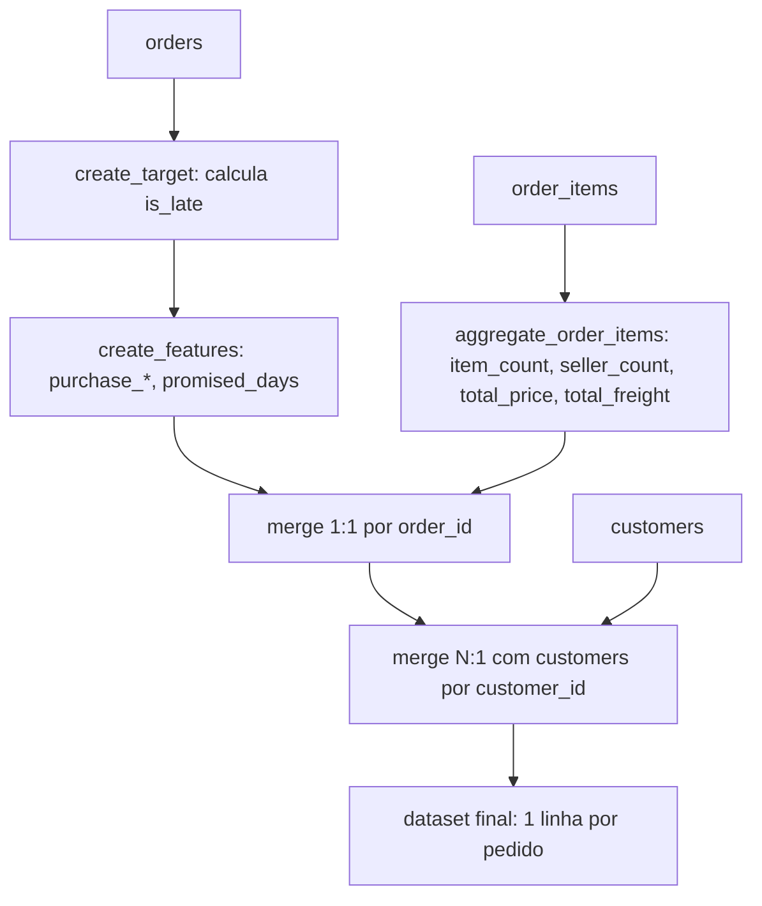

# Features: Engenharia de Atributos

Documentação da etapa de geração de features para o problema de prever se
um pedido será **entregue com atraso** (`is_late`), implementada em
`module_olist/features.py`.

## 1. Alvo (`is_late`)

`create_target` classifica cada pedido comparando a data real de entrega
com a data estimada:

```
is_late = 1  se order_delivered_customer_date > order_estimated_delivery_date
is_late = 0  caso contrário
```

Armazenado como `int8` para economizar memória.

## 2. Features geradas

| Feature | Origem | Descrição |
|---|---|---|
| `purchase_hour` | `order_purchase_timestamp` | Hora da compra (0–23) |
| `purchase_weekday` | `order_purchase_timestamp` | Dia da semana da compra (0=segunda) |
| `purchase_month` | `order_purchase_timestamp` | Mês da compra |
| `purchase_day` | `order_purchase_timestamp` | Dia do mês da compra |
| `promised_days` | `order_estimated_delivery_date - order_approved_at` | Prazo prometido, em dias |
| `item_count` | `order_items` (agregado) | Quantidade de itens no pedido |
| `seller_count` | `order_items` (agregado) | Quantidade de vendedores distintos no pedido |
| `total_price` | `order_items` (agregado) | Soma do preço dos itens |
| `total_freight` | `order_items` (agregado) | Soma do frete dos itens |
| `customer_state` | `customers` | UF do cliente |

> `promised_days` é gerada por `create_features`, mas ainda não está entre
> as `FEATURES` usadas em `module_olist/modeling/split.py` — candidata a
> entrar no modelo em uma próxima iteração.

As quatro primeiras vêm de `order_purchase_timestamp`, disponível no
momento da compra; `promised_days` depende de `order_approved_at`, momento
em que a previsão é de fato realizada (mesmo corte temporal usado por
`create_target` em `modeling/train.py`).

## 3. Pipeline de construção (`create_dataset`)



O merge com `order_items` é validado como `one_to_one` (um pedido já
agregado por `order_id`) e o merge com `customers` como `many_to_one`
(vários pedidos podem pertencer ao mesmo cliente).

## 4. CLI

`module_olist/features.py` roda como CLI (`typer`), no mesmo padrão dos
demais módulos (`dataset.py`, `validation.py`):

```bash
python module_olist/features.py
# ou, com paths customizados
python module_olist/features.py \
    --orders-path data/raw/olist_orders_dataset.csv \
    --items-path data/raw/olist_order_items_dataset.csv \
    --customers-path data/raw/olist_customers_dataset.csv \
    --output-path data/processed/features.csv
```

Carrega os 3 CSVs brutos (`load_dataset`), monta o dataset (`create_dataset`)
e salva o resultado em `data/processed/features.csv` (`save_dataset`).
Erros de carga, merge ou escrita são logados (`loguru`) e relançados.

## 5. Split treino/teste

`module_olist/modeling/split.py` seleciona `FEATURES` e `TARGET` do
dataset gerado e divide em treino/teste (80/20, `stratify=y` para manter a
proporção de pedidos atrasados em ambos os conjuntos):

```python
from module_olist.modeling.split import split_data

X_train, X_test, y_train, y_test = split_data(dataset)
```

Levanta `KeyError` se alguma coluna de `FEATURES`/`TARGET` estiver ausente
em `data`, e `ValueError` se o `train_test_split` falhar (ex.: dados
insuficientes para estratificar).

## 6. Onde encontrar cada coisa

| O que | Onde |
|---|---|
| Criação do alvo `is_late` | `create_target` em `module_olist/features.py` |
| Features temporais e `promised_days` | `create_features` em `module_olist/features.py` |
| Agregação de itens por pedido | `aggregate_order_items` em `module_olist/features.py` |
| Montagem do dataset final | `create_dataset` em `module_olist/features.py` |
| CLI de geração das features | `python module_olist/features.py` |
| Lista de features do modelo e split treino/teste | `module_olist/modeling/split.py` |
| Dataset processado gerado | `data/processed/features.csv` |
